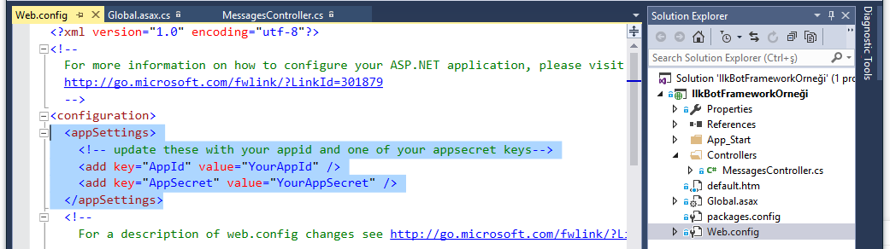
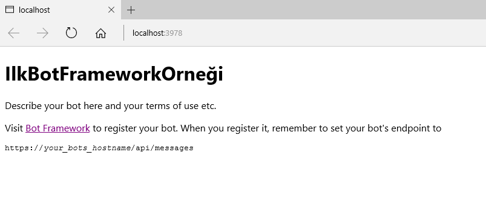
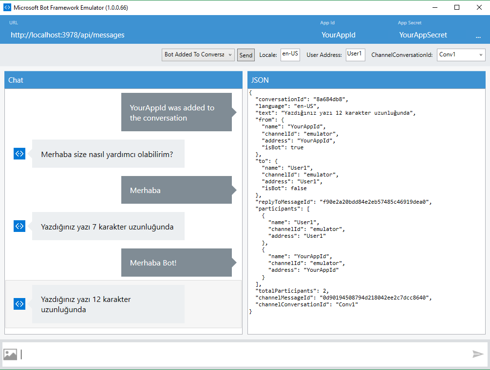

# İlk Bot Framework Örneği
Bu örnek ile Visual Studio 2015 kullanarak Microsoft Bot Framework kullanılarak bir bot uygulamasının geliştirilmesi için gerekli gereksinimleri ve temelleri öğreneceksiniz.

## Prerequisites to build a new Bot using Bot Framework
This is a step-by-step guide to writing an Bot in C# using the Bot Framework Connector SDK .NET template.

1. Install prerequisite software
* Visual Studio 2015 (latest update) - you can download the community version here for free: www.visualstudio.com
* Important: Please update all VS extensions to their latest versions Tools->Extensions and Updates->Updates

2. Download and install the Bot Application template 
3. * Download the file from the direct download link [here](http://aka.ms/bf-bc-vstemplate) :
* Save the zip file to your Visual Studio 2015 templates directory which is traditionally in “%USERPROFILE%\Documents\Visual Studio 2015\Templates\ProjectTemplates\Visual C

3. Open Visual Studio

4. Create a new C# project using the new Bot Application template.

5. The template is a fully functional Echo Bot that takes the user’s text utterance as input and returns it as output. In order to run however, 
* The bot has to be registered with Bot Connector
* The AppId and AppSecret from the Bot Framework registration page have to be recorded in the project’s web.config
* The project needs to be published to the web

## AppID and AppSecret
- Bot has unique AppID and AppSecret whenever you publish to botframework.com, it comes with default settings like below. in order to test in your bot emulator you need to make sure AppID and AppSecret are ok.
 

## Build the sample Bot Project
1. If you download the samples ZIP, be sure to unzip the entire archive, not just the folder with the sample you want to build. 
2. Start Microsoft Visual Studio 2015 and select **File** \> **Open** \> **Project/Solution**.
3. Starting in the folder where you unzipped the samples, go to the Samples subfolder, then the subfolder for this specific sample. Double-click the Visual Studio 2015 Solution (.sln) file.
4. Press Ctrl+Shift+B, or select **Build** \> **Build Solution**.

## Deploying and running bot endpoint
- To debug the bot sample and then run it, press F5 or select Debug >  Start Debugging. To run the sample without debugging, press Ctrl+F5 or select Debug > Start Without Debugging. After that you'll see below running bot endpoint.

 

## Running Bot Emulator
- Search "Microsoft Bot Framework Emulator" from your program and files. This will help you to test your bot endpoint before publishing it. It has a chatbot interface in order to test capabilities of your bot. And before adding a bot into conversation make sure your AppID and AppSecret are ok. From combobox select "Bot Added to Conversation" then click "Send" button. you'll see below first welcome message we've added. Type your message and recieve the response from bot.  
 

For next step you can deploy this chat bot into dev.botframework.com, we'll check this step later.
